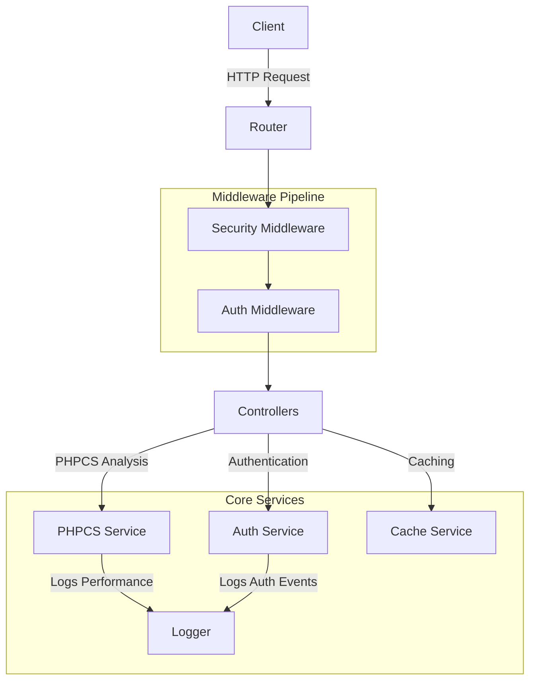
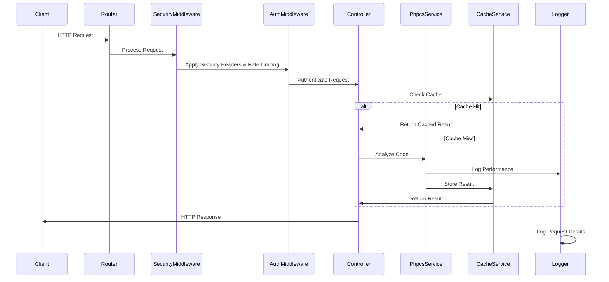

# PHPCS API Architecture

This document provides a high-level overview of the PHPCS API architecture, explaining how the different components interact with each other.

## System Overview

The PHPCS API is designed as a RESTful service that provides PHP_CodeSniffer functionality over HTTP. It follows a middleware-based architecture with a clear separation of concerns between components.

## Request Flow

The following sequence diagram illustrates the typical flow of a request through the system:

## Core Components

### Router (`Router.php`)

The Router is responsible for mapping HTTP requests to the appropriate controller methods. It parses the request path and method to determine which handler should process the request.

Key responsibilities:
- Route registration
- Request dispatching
- 404 handling for unknown routes

### Middleware

The API uses a middleware pipeline to process requests before they reach the controllers.

#### Security Middleware (`SecurityMiddleware.php`)

Handles security-related concerns:
- Rate limiting to prevent abuse
- CORS headers for cross-origin requests
- Security headers to protect against common web vulnerabilities

#### Authentication Middleware (`AuthMiddleware.php`)

Handles authentication:
- API key validation
- Scope checking
- Protected path enforcement

### Controllers

Controllers handle the business logic for each endpoint. They receive the request, process it, and return a response.

The main endpoints are:
- `/analyze` - Analyzes PHP code using PHPCS
- `/standards` - Lists available PHPCS standards
- `/health` - Health check endpoint
- `/cache/clear` - Clears the cache (admin only)
- `/cache/stats` - Shows cache statistics (admin only)
- `/keys/generate` - Generates API keys (admin/development only)

### Services

#### PHPCS Service (`PhpcsService.php`)

Provides an interface to PHP_CodeSniffer:
- Code analysis against various standards
- Standard listing
- Performance tracking for PHPCS operations

#### Authentication Service (`AuthService.php`)

Manages API keys and authentication:
- API key validation
- Scope checking
- Key generation and management

#### Cache Service (`CacheService.php`)

Handles caching of PHPCS results:
- Cache key generation
- Storage and retrieval
- TTL and expiration
- Cache statistics

#### Logger (`Logger.php`)

Provides comprehensive logging capabilities:
- Multiple log levels (DEBUG, INFO, WARNING, ERROR, CRITICAL)
- Performance metrics tracking
- Security event logging
- Request correlation with unique IDs
- Context-rich logging

### Request and Response

#### Request (`Request.php`)

Represents an HTTP request:
- Method (GET, POST, etc.)
- Path
- Headers
- Query parameters
- Body

#### Response (`Response.php`)

Represents an HTTP response:
- Status code
- Headers
- Body
- Helper methods for common response types (JSON, error, etc.)

## Data Flow

1. The client sends an HTTP request to the API
2. The Router determines which controller should handle the request
3. The request passes through the middleware pipeline:
   - SecurityMiddleware applies rate limiting and security headers
   - AuthMiddleware validates the API key and checks scopes
4. The controller receives the authenticated request
5. For analysis requests:
   - The controller checks the cache for existing results
   - If not found, it uses PhpcsService to analyze the code
   - Results are cached for future requests
6. The controller returns a response
7. The Logger records details about the request, performance, and any security events

## Configuration

The API is configured through a central configuration file (`config.php`), which includes settings for:
- Authentication
- Security
- PHPCS
- Caching
- Logging

## Error Handling

The API uses a consistent error handling approach:
- HTTP status codes for different error types
- JSON error responses with error code and message
- Detailed logging of errors
- Rate limiting for failed authentication attempts

## Performance Considerations

Several mechanisms are in place to ensure good performance:
- Caching of PHPCS results
- Rate limiting to prevent abuse
- Performance metrics logging
- Configurable thresholds for slow operations

## Security Measures

The API implements multiple security measures:
- API key authentication
- Scope-based authorization
- Rate limiting
- Security headers
- Input validation and sanitization
- Logging of security events
