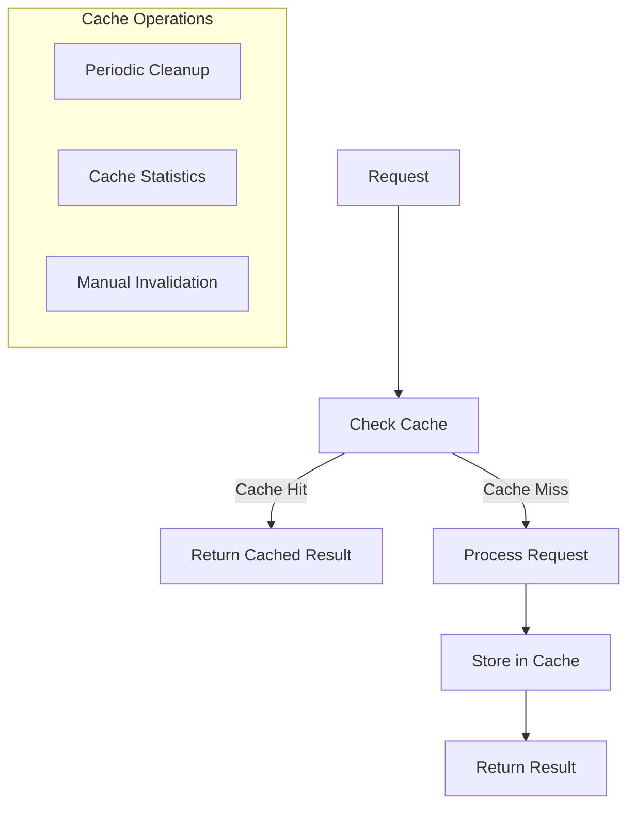

# PHPCS API Caching System

This document describes the caching system implemented in the PHPCS API.

## Overview

The PHPCS API includes a robust caching system that improves performance by storing the results of PHPCS analyses. This reduces the need to repeatedly analyze the same code, resulting in faster response times and reduced server load.



## Cache Key Generation

Cache keys are generated based on the following factors:

- The PHP code being analyzed
- The PHPCS standard being used
- Any additional PHPCS options

This ensures that each unique combination of code and analysis parameters has its own cache entry.

The key generation algorithm uses a secure hash function (SHA-256) to create a deterministic, fixed-length key from the input parameters:

```php
$key = hash('sha256', json_encode([
    'code' => $code,
    'standard' => $standard,
    'options' => $options
]));
```

## Cache Storage

The cache is stored on the filesystem in the `cache` directory. Each cache entry is stored in a separate file, with the filename being the cache key.

The cache files are JSON-encoded and contain:

- The original request parameters
- The PHPCS analysis results
- Metadata such as creation time and TTL

Example of a cache file structure:

```json
{
  "key": "a1b2c3d4e5f6...",
  "created": 1709942400,
  "expires": 1710028800,
  "request": {
    "code": "<?php echo \"Hello World\"; ?>",
    "standard": "PSR12",
    "options": {
      "report": "json",
      "showSources": true
    }
  },
  "result": {
    "success": true,
    "results": {
      "totals": {
        "errors": 1,
        "warnings": 0,
        "fixable": 1
      },
      "files": {
        "code.php": {
          "errors": 1,
          "warnings": 0,
          "messages": [
            {
              "message": "Double quoted string contains a single quote",
              "source": "Squiz.Strings.DoubleQuoteUsage.ContainsSingleQuote",
              "severity": 5,
              "type": "ERROR",
              "line": 1,
              "column": 12,
              "fixable": true
            }
          ]
        }
      }
    }
  }
}
```

## Cache Retrieval

When a request is received, the API first checks if a valid cache entry exists:

1. Generate the cache key from the request parameters
2. Check if a cache file exists for that key
3. If it exists, check if it has expired
4. If it's still valid, return the cached result

If no valid cache entry is found, the API proceeds with the PHPCS analysis and then caches the result.

## TTL and Expiration

Each cache entry has a Time-To-Live (TTL) that determines how long it remains valid. The default TTL is configurable in `config.php`:

```php
'cache' => [
    'enabled' => true,
    'ttl' => 86400, // 24 hours in seconds
    // ...
],
```

You can set different TTLs for different types of requests:

```php
'cache' => [
    // ...
    'ttl_by_standard' => [
        'PSR12' => 604800, // 1 week for PSR12 standard
        'PHPCompatibility' => 2592000, // 30 days for compatibility checks
    ],
    // ...
],
```

When a cache entry expires, it will be regenerated the next time that specific code is analyzed.

## Cache Invalidation

The cache can be invalidated in several ways:

### Automatic Invalidation

- When a cache entry expires (based on TTL)
- When the cache size exceeds the configured maximum

### Manual Invalidation

The API provides endpoints for manual cache invalidation (requires admin scope):

- `/cache/clear` - Clears the entire cache
- `/cache/clear/{key}` - Clears a specific cache entry

You can also use the command-line tool:

```bash
php bin/manage-cache.php clear
php bin/manage-cache.php clear a1b2c3d4e5f6...
```

## Cache Size Management

To prevent the cache from growing too large, the API includes mechanisms for managing cache size:

```php
'cache' => [
    // ...
    'max_size' => 100 * 1024 * 1024, // 100MB
    'max_entries' => 1000,
    'cleanup_probability' => 0.01, // 1% chance of cleanup on each request
    // ...
],
```

When the cache exceeds these limits, or randomly based on the cleanup probability, the API will remove the oldest or least recently used entries.

## Cache Statistics

The API tracks statistics about cache usage, which can be viewed through the `/cache/stats` endpoint (requires admin scope):

```json
{
  "success": true,
  "stats": {
    "total_entries": 256,
    "total_size": 5242880,
    "hit_count": 1024,
    "miss_count": 128,
    "hit_ratio": 0.89,
    "oldest_entry": 1709942400,
    "newest_entry": 1710028800,
    "by_standard": {
      "PSR12": 128,
      "PSR2": 64,
      "PHPCompatibility": 32,
      "WordPress": 32
    }
  }
}
```

You can also view these statistics using the command-line tool:

```bash
php bin/manage-cache.php stats
```

## Performance Considerations

The caching system is designed to be as efficient as possible:

- Cache keys are generated using a fast hash function
- Cache files are stored directly on the filesystem for quick access
- Cache entries include all necessary metadata to avoid additional lookups
- Cache cleanup is performed asynchronously to avoid impacting request performance

## Logging

The caching system logs various events to help with monitoring and troubleshooting:

- Cache hits and misses
- Cache entry creation and expiration
- Cache cleanup operations
- Cache invalidation events

These logs include performance metrics such as cache lookup time and hit ratio.

## Troubleshooting

If you're experiencing issues with the cache:

1. Check that caching is enabled in `config.php`
2. Verify that the cache directory exists and is writable
3. Check the logs for any cache-related errors
4. Try clearing the cache manually
5. Adjust the TTL settings if cache entries are expiring too quickly or not quickly enough

## Using the Cache Service

The `CacheService` class provides methods for interacting with the cache:

```php
// Get an item from the cache
$result = $cacheService->get($key);

// Store an item in the cache
$cacheService->set($key, $value, $ttl);

// Check if an item exists in the cache
$exists = $cacheService->has($key);

// Remove an item from the cache
$cacheService->delete($key);

// Clear the entire cache
$cacheService->clear();

// Get cache statistics
$stats = $cacheService->getStats();
```

## Cache Headers

The API includes cache-related headers in its responses:

- `X-Cache`: Indicates whether the response was served from cache (`HIT` or `MISS`)
- `X-Cache-Key`: The cache key for the request (truncated for security)
- `X-Cache-TTL`: The TTL for the cache entry in seconds
- `X-Cache-Expires`: The expiration timestamp for the cache entry

These headers can be useful for debugging and monitoring cache behavior.
