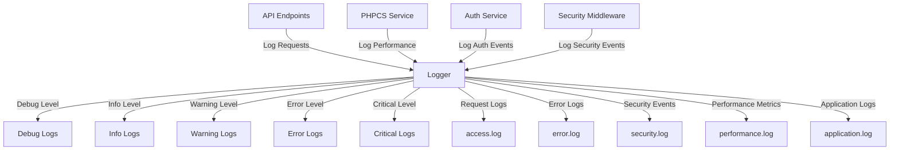

# PHPCS API Logging System

This document describes the enhanced logging system implemented in the PHPCS API.

## Overview

The PHPCS API includes a comprehensive logging system that provides visibility into application behavior, performance, and security events. The logging system is designed to be configurable, allowing you to adjust the level of detail based on your needs.



## Log Levels

The logging system supports five log levels, in order of increasing severity:

1. **DEBUG**: Detailed information, typically of interest only when diagnosing problems.
2. **INFO**: Confirmation that things are working as expected.
3. **WARNING**: Indication that something unexpected happened, or may happen in the future.
4. **ERROR**: Due to a more serious problem, the software has not been able to perform some function.
5. **CRITICAL**: A serious error, indicating that the program itself may be unable to continue running.

The log level can be configured in `config.php`:

```php
'logging' => [
    'enabled' => true,
    'log_level' => 'info', // debug, info, warning, error, critical
    // ...
],
```

Only messages at or above the configured log level will be recorded.

## Log Files

The logging system writes to several log files, each focused on a specific type of information:

- **application.log**: General application logs, organized by log level.
- **access.log**: HTTP request logs, including method, path, status code, and timing information.
- **error.log**: Error logs with detailed information about exceptions and errors.
- **security.log**: Security-related events, such as authentication failures and potential attacks.
- **performance.log**: Performance metrics for various operations.
- **auth.log**: Authentication attempts and results.

All log files are stored in the `logs` directory.

## Log Format

Logs are stored in JSON format, making them easy to parse and analyze. Each log entry includes:

- **timestamp**: The date and time when the log was created.
- **request_id**: A unique identifier for the request, allowing correlation across log files.
- **level** (for application logs): The log level (debug, info, warning, error, critical).
- **type** (for specialized logs): The type of log (request, error, security, performance, auth).
- **message**: A human-readable description of the event.
- **context**: Additional contextual information relevant to the log entry.

Example of an application log entry:

```json
{
  "timestamp": "2025-03-09 10:15:23",
  "request_id": "req_6441f3e8a1b2c",
  "level": "info",
  "message": "Cache hit for PHPCS analysis",
  "context": {
    "standard": "PSR12",
    "code_size": 1024,
    "key": "a1b2c3d4..."
  }
}
```

Example of a request log entry:

```json
{
  "timestamp": "2025-03-09 10:15:23",
  "request_id": "req_6441f3e8a1b2c",
  "type": "request",
  "method": "POST",
  "path": "/analyze",
  "status": 200,
  "ip": "192.168.1.1",
  "duration": 0.1234,
  "performance": {
    "duration_ms": 123.4,
    "memory_usage": "5.67 MB"
  }
}
```

## Request Correlation

Each incoming request is assigned a unique request ID, which is included in all log entries related to that request. This allows you to trace the complete lifecycle of a request across different log files.

The request ID is also returned in the response headers as `X-Request-ID`, making it easier to correlate client-side and server-side logs.

## Performance Metrics

The logging system includes detailed performance metrics for various operations:

- **Request duration**: The total time taken to process a request.
- **PHPCS execution time**: The time taken to execute PHPCS analysis.
- **Cache operations**: Timing for cache lookups and storage.
- **Memory usage**: The amount of memory used during the operation.

Performance thresholds can be configured to automatically flag slow operations:

```php
'logging' => [
    // ...
    'slow_threshold' => 1.0, // Threshold for slow requests (seconds)
    'performance_threshold' => [
        'analyze' => 0.5, // Threshold for PHPCS analysis
        'standards' => 0.2, // Threshold for standards listing
        'cache_lookup' => 0.05, // Threshold for cache lookups
        'database' => 0.1, // Threshold for database operations
    ],
    // ...
],
```

When an operation exceeds its threshold, a warning is logged automatically.

## Security Event Tracking

The logging system tracks various security events:

- **Authentication failures**: Failed login attempts, including the reason for failure.
- **Rate limit exceeded**: Requests that exceed the configured rate limits.
- **Suspicious requests**: Potentially malicious requests, such as injection attempts.
- **Access violations**: Attempts to access resources without proper authorization.

Security events are logged to both `security.log` and `application.log` (at the appropriate log level).

## Sensitive Data Protection

The logging system automatically redacts sensitive information to prevent it from appearing in logs:

- API keys are truncated to show only the first few characters.
- Passwords and tokens are completely redacted.
- Other sensitive fields (configurable) are replaced with `[REDACTED]`.

## Log Rotation

To prevent log files from growing too large, the logging system supports log rotation:

```php
'logging' => [
    // ...
    'max_log_size' => 10 * 1024 * 1024, // 10MB
    'max_log_files' => 10, // Keep 10 rotated log files
    // ...
],
```

When a log file exceeds the maximum size, it is renamed with a timestamp suffix, and a new log file is created.

## Using the Logger

The `Logger` class provides methods for logging at different levels:

```php
// Log at specific levels
$logger->debug('Detailed debug information', ['context' => 'value']);
$logger->info('Something happened', ['item_id' => 123]);
$logger->warning('Something unexpected', ['details' => $details]);
$logger->error('An error occurred', ['exception' => $e->getMessage()]);
$logger->critical('System is unusable', ['reason' => $reason]);

// Log specific types of events
$logger->logRequest($method, $path, $statusCode, $ip, $userAgent, $duration, $headers, $params);
$logger->logError($message, $path, $trace, $context);
$logger->logSecurityEvent($event, $message, $context);
$logger->logPerformance($operation, $duration, $metrics);
$logger->logAuthAttempt($path, $apiKey, $successful, $reason, $ip, $userAgent);

// Get the current request ID
$requestId = $logger->getRequestId();
```

## Log Analysis

Since logs are stored in JSON format, they can be easily analyzed using various tools:

- **jq**: A command-line JSON processor.
- **ELK Stack**: Elasticsearch, Logstash, and Kibana for log aggregation and visualization.
- **Graylog**: A log management platform.
- **Custom scripts**: Simple scripts to parse and analyze logs.

Example of using jq to analyze logs:

```bash
# Count errors by type
cat error.log | jq -r '.type' | sort | uniq -c

# Find slow requests (>1s)
cat access.log | jq -r 'select(.duration > 1.0) | [.timestamp, .method, .path, .duration] | @tsv'

# Analyze authentication failures
cat security.log | jq -r 'select(.event == "auth_failure") | [.timestamp, .ip, .reason] | @tsv'
```

## Troubleshooting

If you're not seeing logs:

1. Check that logging is enabled in `config.php`.
2. Verify that the log directory exists and is writable.
3. Check the log level setting to ensure it's not filtering out your logs.
4. Look for PHP errors in the server error log.

If logs are too verbose:

1. Increase the log level (e.g., from `debug` to `info` or `warning`).
2. Adjust the performance thresholds to reduce performance-related logs.
3. Configure log rotation to manage file sizes.
