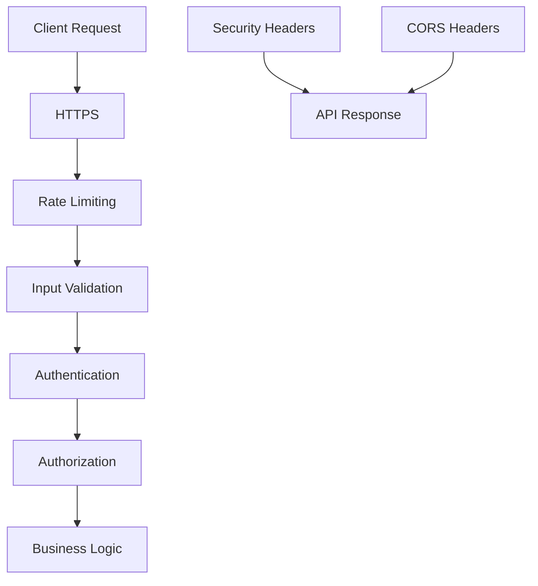

# PHPCS API Security

This document describes the security measures implemented in the PHPCS API.

## Overview

The PHPCS API implements multiple layers of security to protect against various threats and ensure that only authorized clients can access the API.



## Authentication

The API uses API key authentication to secure access to protected endpoints. See [Authentication](authentication.md) for detailed information on:

- API key format and management
- Authentication methods (headers, query parameters)
- Scopes and permissions
- Key generation and revocation

## Rate Limiting

Rate limiting is implemented to prevent abuse and ensure fair usage of the API.

### Default Limits

- 60 requests per minute per IP address
- 1000 requests per hour per IP address
- 30 requests per minute per API key

### Configuration

Rate limiting can be configured in `config.php`:

```php
'security' => [
    'rate_limit' => [
        'enabled' => true,
        'ip_minute_limit' => 60,
        'ip_hour_limit' => 1000,
        'key_minute_limit' => 30,
        'whitelist' => ['127.0.0.1', '::1'],
    ],
    // ...
],
```

### Response Headers

When rate limiting is in effect, the API includes the following headers in responses:

- `X-RateLimit-Limit`: The maximum number of requests allowed in the current time window
- `X-RateLimit-Remaining`: The number of requests remaining in the current time window
- `X-RateLimit-Reset`: The time when the current rate limit window resets (Unix timestamp)

### Rate Limit Exceeded

When a client exceeds the rate limit, the API responds with:

- HTTP status code: `429 Too Many Requests`
- Response body:
  ```json
  {
    "error": "Rate limit exceeded",
    "message": "You have exceeded the 60 requests per minute rate limit.",
    "retry_after": 45
  }
  ```
- `Retry-After` header: Seconds until the rate limit resets

### Special Considerations

- Failed authentication attempts have a stricter rate limit to prevent brute force attacks
- Certain endpoints (e.g., `/health`) may have different rate limits or be exempt
- IP addresses can be whitelisted to bypass rate limiting

## Input Validation and Sanitization

All input is validated and sanitized to prevent injection attacks and other security issues.

### Code Validation

PHP code submitted for analysis is validated to ensure it doesn't exceed size limits:

```php
'phpcs' => [
    'max_code_size' => 1024 * 1024, // 1MB
    // ...
],
```

### Parameter Validation

Request parameters are validated against schemas to ensure they meet expected formats and constraints.

### Error Responses

When validation fails, the API responds with:

- HTTP status code: `400 Bad Request`
- Response body with details about the validation error

## Security Headers

The API includes several security headers to protect against common web vulnerabilities:

| Header | Value | Purpose |
|--------|-------|---------|
| `X-Content-Type-Options` | `nosniff` | Prevents MIME type sniffing |
| `X-Frame-Options` | `DENY` | Prevents clickjacking attacks |
| `X-XSS-Protection` | `1; mode=block` | Enables browser XSS protection |
| `Strict-Transport-Security` | `max-age=31536000; includeSubDomains` | Enforces HTTPS |
| `Content-Security-Policy` | `default-src 'self'; script-src 'self'; object-src 'none'; frame-ancestors 'none'` | Restricts resource loading |
| `Referrer-Policy` | `strict-origin-when-cross-origin` | Controls referrer information |

These headers can be configured in `config.php`:

```php
'security' => [
    'headers' => [
        'X-Content-Type-Options' => 'nosniff',
        'X-Frame-Options' => 'DENY',
        // ...
    ],
    // ...
],
```

## CORS (Cross-Origin Resource Sharing)

CORS is configured to control which domains can access the API from browser-based applications.

### Default Configuration

By default, CORS is configured to allow requests from any origin in development mode, but is more restrictive in production.

```php
'security' => [
    'cors' => [
        'enabled' => true,
        'allow_origins' => ['*'], // In development
        'allow_methods' => ['GET', 'POST', 'OPTIONS'],
        'allow_headers' => ['Content-Type', 'Authorization', 'X-API-Key'],
        'expose_headers' => ['X-Request-ID', 'X-RateLimit-Limit', 'X-RateLimit-Remaining', 'X-RateLimit-Reset'],
        'max_age' => 86400, // 24 hours
    ],
    // ...
],
```

### Production Configuration

In production, it's recommended to restrict allowed origins:

```php
'security' => [
    'cors' => [
        'allow_origins' => ['https://your-app.com', 'https://another-app.com'],
        // ...
    ],
    // ...
],
```

## Request Size Limits

To prevent DoS attacks, the API limits the size of incoming requests:

```php
'security' => [
    'max_request_size' => 2 * 1024 * 1024, // 2MB
    // ...
],
```

Requests exceeding this limit will receive a `413 Payload Too Large` response.

## Security Event Logging

Security-related events are logged to help detect and respond to potential security issues:

- Authentication failures
- Rate limit exceeded events
- Input validation failures
- Suspicious requests

See [Logging](logging.md) for more information on security event logging.

## IP Blocking

The API can be configured to block requests from specific IP addresses or ranges:

```php
'security' => [
    'ip_blacklist' => [
        '192.168.1.1',
        '10.0.0.0/8',
    ],
    // ...
],
```

Requests from blacklisted IPs receive a `403 Forbidden` response.

## API Key Security

API keys are stored securely using the following measures:

- Keys are hashed using a strong one-way hash function (bcrypt)
- Original keys are never stored, only their hashes
- Key validation is performed using constant-time comparison to prevent timing attacks

## HTTPS Enforcement

In production, the API should be deployed behind HTTPS to ensure that all communication is encrypted. The `Strict-Transport-Security` header is included to enforce HTTPS usage.

## Security Middleware

The `SecurityMiddleware` class implements many of these security measures. It runs early in the request pipeline to ensure that security checks are performed before any business logic.

## Security Best Practices for API Users

API users should follow these best practices:

1. **Store API keys securely**: Never hardcode keys in client-side code or commit them to version control.
2. **Use HTTPS**: Always use HTTPS when communicating with the API.
3. **Implement retry logic**: Handle rate limiting gracefully by respecting the `Retry-After` header.
4. **Validate responses**: Always validate API responses before using them.
5. **Keep dependencies updated**: Ensure that any libraries used to interact with the API are kept up to date.

## Security Vulnerability Reporting

If you discover a security vulnerability in the PHPCS API, please report it responsibly by emailing [security@example.com](mailto:security@example.com). Do not disclose the vulnerability publicly until it has been addressed.

## Regular Security Audits

The API code undergoes regular security audits to identify and address potential vulnerabilities. This includes:

- Static code analysis
- Dependency scanning
- Penetration testing
- Code reviews focused on security

## Additional Security Measures

### Request ID Tracking

Each request is assigned a unique ID that is included in all logs and responses. This helps with debugging and security incident investigation.

### Error Handling

Error messages are designed to provide useful information without revealing sensitive details about the system.

### Dependency Management

Dependencies are regularly updated to ensure that security patches are applied promptly.
